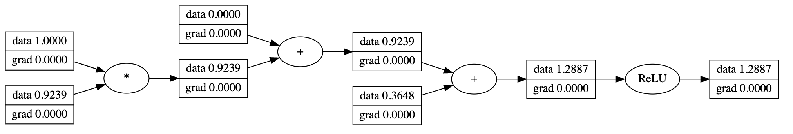

# micrograd

This project is based on Andrej Karpathy's amazing work on [micrograd](https://github.com/karpathy/micrograd). Based on the original micrograd, an optimizer module is further added to make it more similar to PyTorch API.

This is a tiny Autograd engine that implements the backpropagation algorithm upon a dynamically built computational graph and a small PyTorch-like neural network library. 


### Example usage

Below shows several operations of `Variable`:

```python
from micrograd.engine import Value

a = Value(1.0)
b = Value(-2.0)
c = a + b * b**2
d = c * 2 + (b - a).tanh()
d += 1.0
e = d / 5.0
print(f'{e.data:.4f}') # prints -2.799, the outcome of this forward pass
e.backward()
print(f'{a.grad:.4f}') # prints 0.3980, i.e. the numerical value of de/da
print(f'{b.grad:.4f}') # prints 3.2000, i.e. the numerical value of de/db
```


### Example of training a neural network

`Demo.ipynb` provides a complete demo of training a two-layer multi-layer perceptron (MLP) binary classfifier with SGD optimizer by using `micrograd.engine`, `micrograd.nn` and `micrograd.optimizer` modules. Following is the result on the moon dataset:


### Computational graph visualization

The `visualize_computational_graph` function in `micrograd.visualization` plots the computational graph of a given variable.

```python
from micrograd import nn
n = Neuron(1)
x = [Value(1.0)]
y = n(x)
visualize_computational_graph(y)
```

